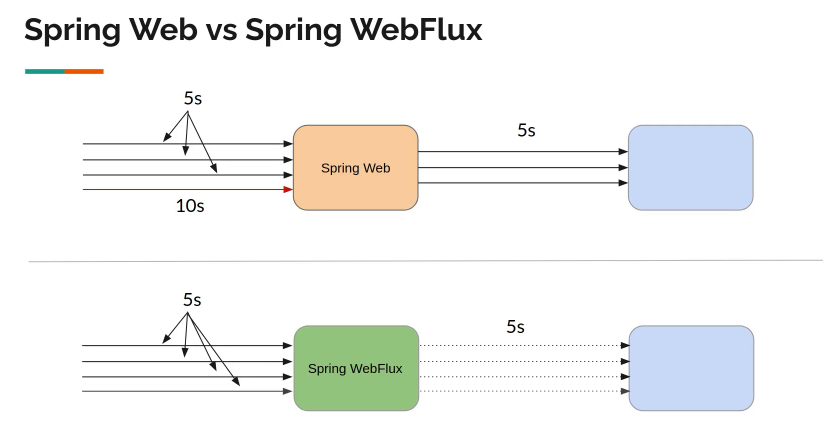

## Chapter 2. Need For WebFlux

* 두 개념을 쉽게 이해하기 위해 두 개의 서비스가 존재한다고 가정한다.
    * `Spring Web` 기반 서비스
    * `Spring WebFlux` 기반 서비스
* 각 서비스 별로 가용한 스레드가 3개 있다.
* 두 서비스 모두 동시에 4개의 요청을 받는다.
* 두 서비스 모두 로직 수행 중간에 외부 서비스에게 데이터를 요청한다. 
* Blocking And Wait
    * `Spring Web` 기반 서비스는 요청을 보내면 응답을 받기 전까지 대기한다.
    * 이런 경우를 블록킹(blocking)되었다고 표현한다.
    * 가용한 스레드가 3개 뿐이므로 4번째 들어온 요청은 자신의 요청을 처리할 스레드가 생기기 전까지 대기하게 된다. 
* Non blocking And Async
    * `Spring WebFlux` 기반 서비스는 요청을 보내면 응답을 기다리지 않는다.
    * 이런 경우 블록킹되지 않았으므로 논-블록킹이다.
    * 추후에 요청에 대한 응답을 받으면 그 시점에 필요한 로직을 수행 후 응답한다.
    * 모든 요청은 가용한 스레드와 상관없이 처리된다.

