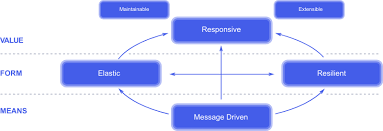

## Chapter 4. Reactive Manifesto

* 분산 시스템에서 중요한 관점에 대해 정리한 내용이다.
* 응답성(responsive)
    * 시스템이 가능한 한 즉각적으로 응답할 수 있어야 한다. 
    * 문제를 신속하게 탐지하고 효과적으로 대처할 수 있어야 한다.
* 탄력성(resilient)
    * 시스템이 장애에 직면하더라도 응답성을 유지할 수 있어야 한다.
    * 탄력성은 고가용성 시스템, 미션 크리티컬 시스템에만 적용되는 것이 아니다.
    * 탄력성은 복제, 봉쇄, 격리, 위임에 의해 실현된다.
* 유연성(elastic)
    * 시스템의 작업량이 변하더라도 응답성을 유지할 수 있어야 한다.
    * 입력 속도의 변화에 따라 이러한 입력에 할당된 자원을 증가시키거나 감소시키면서 변화에 대응해야 한다.
* 메세지 구동(message driven)
    * 비동기 메세지 전달에 의존하여 구성 요소 사이에서 느슨한 결합, 격리, 위치 투명성을 보장할 수 있어야 한다.
    * 이 경계는 장애를 메세지로 지정하는 수단을 제공한다.
    * 명시적인 메세지 전달은 시스템에 메세지 큐를 생성하고, 모니터링한다.
* 자세한 내용은 다음 링크를 참조한다.
    * <https://www.reactivemanifesto.org/ko>

 
    

